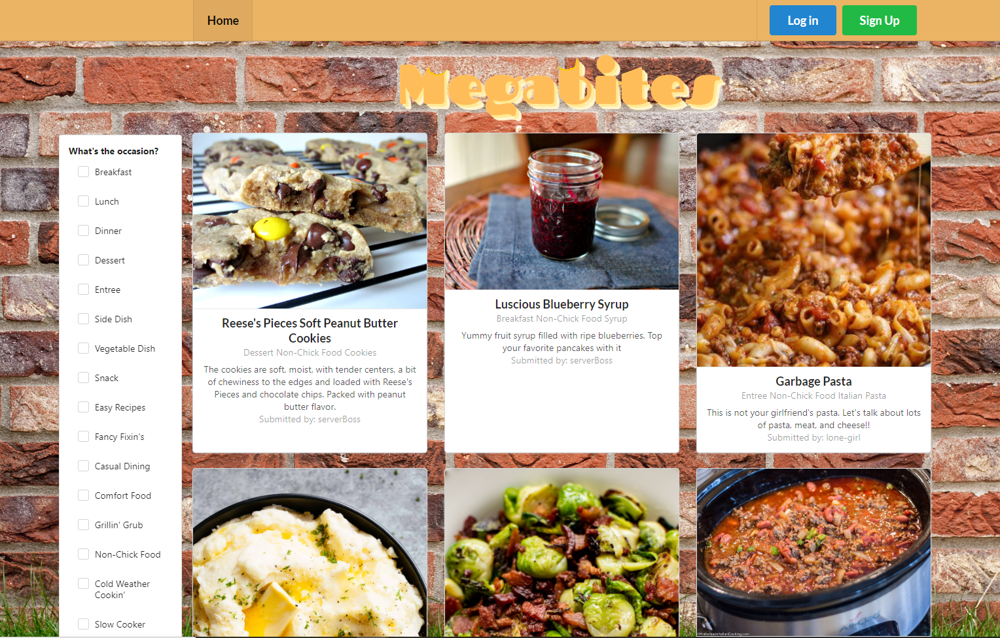
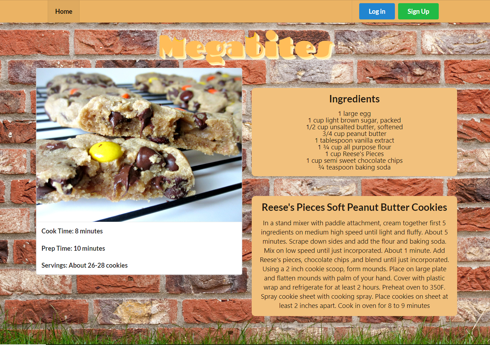
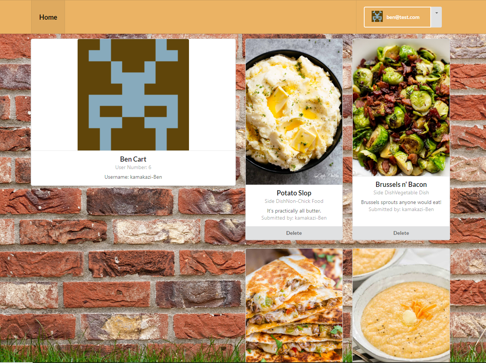

# Megabites Recipe App

## Description
Megabites provides users with a place to find, create and share recipes. Users are free to create recipes, browse recipes posted by others, and save recipes to their profiles. Recipes are easy to find and use and are not buried beneath 1500 lines of the creator’s story about how they found this recipe in the first place.


## Deployment

[Megabites](https://https://megabytes.herokuapp.com/)


## Table of Contents

* [Technology Used](#technology-used)
* [Usage](#usage)
* [Screenshots](#screenshots)
* [MVP - Minimum Viable Product](#mvp-minimum-viable-product)
  * [User Story](#user-story)
  * [Acceptance Criteria](#acceptance-criteria)
* [Questions](#questions)
* [Contributing](#contributing)
* [Badges](#badges)
* [Authors](#author)

## Technology Used
<details>
    <summary markdown="span">Click to expand Project Technology Details</summary>

Languages
- HTML
- CSS
- Javascript

Libraries
- React
- React-Router
- Semantic-UI-React
- Axios
- Express
- Node
- MySQL2
- Sequelize

CSS Framework
- [Semantic UI](semantic-ui.com)

</details>

## Usage

To begin using Megabites, any user may browse the homepage which provides a brief description of the recipe, its categories, and the creator's username. The homepage recipes are an assortment of recipes from the community that can be filtered by selecting a category from the drop-down menu. Any user can click on the recipe to be taken to a recipe page that displays the full details of the recipe including cooking instructions and ingredients.

By completing the signup, users become members with the priviledges to create recipes and save recipes from the community. To create a login, click on the signup button to be taken to the signup form. The only information that will be made public is the username of the member. This lets other users know who posted the recipe for the community to enjoy. Once the signup form has been submitted, users are free to login and begin building their personalized list of recipes.

Member users can create a recipe by clicking on the down arrow next to their member name and selecting "Add a recipe" from the dropdown menu. This will take the member to the form to complete to submit a recipe to the community. Recipes will be saved to both the community home page and the member's page.

Members also have the added feature of saving a community recipe to their page. Once a user is logged in, a save button appears at the bottom of each recipe card. Users can click on this button while browsing to add recipes to their personal page. The save button will not redirect the user to their homepage, but remain on the community page to allow the user to continue browsing without losing their place. Users will also find this save button located on the full recipe page to make saving new and interesting recipes very easy.

An additional feature for members is the delete button on their personal page. When users save a recipe to their personal page, they have the ability to delete the recipes they are no longer interested in keeping. While the recipe is removed from the member's personal page, it remains available to other users through the community home page.


## Screenshots



*Home Page of Recipe App*



*Full Recipe Page*



*Member Portfolio Page*


## MVP - Minimum Viable Product

<details>
    <summary markdown="span">Click to expand Assignment Instruction Details</summary>

  ### User Story

    ```
    AS A user with no creativity in the kitchen
    I WANT to have quick access to recipes
    SO THAT I can prepare delicious new foods by following simple instructions
    ```

  ### Acceptance Criteria

    ```
    GIVEN I would like to browse for interesting recipes
    WHEN I am on the home page of the app
    THEN I can browse recipes that I and other community members have created on the app

    GIVEN I would like to find recipes in specific categories
    WHEN I select specific categories in the filter box
    THEN I am provided only the recipes within those categories

    GIVEN I am interested in making a recipe
    WHEN I click on the recipe card
    THEN I am taken to a detailed recipe page

    GIVEN I would like to save recipes that interest me
    WHEN I create a user profile
    THEN I am provided a space to save recipes for easy access

    GIVEN I would like to save recipes to my personal profile
    WHEN I click on the save button of the recipe card
    THEN I can find that recipe saved to my personal profile page

    GIVEN I would like to remove a recipe from my personal portfolio page
    WHEN I click on the delete button on the recipe card
    THEN I find the recipe is removed from my personal portfolio page

    GIVEN I would like to create and share a recipe
    WHEN I complete the Add Recipe Form
    THEN I find the recipe is available to all users on the home page and also on my personal page
    ```
</details>
----

## Future Development
<details>
    <summary markdown="span">Click to expand Assignment Instruction Details</summary>

There are many future development plans for this recipe app. The developers would like to increase the functionality and improve the user experience and interface in the following ways.

### User Experience
Allow users to search recipes by title or ingredients
Allow users to create reviews and post star ratings for each recipe
Allow users to modify or delete their own reviews
Allow users to create shopping lists of ingredients based on recipe selections
Allow users to edit previous recipe submissions
Allow users to upload images for their user profile and recipes
Allow users to create their own categories

### Improved functionality
Use React Toastify npm library to notify users save requests have been completed
Star ratings will be averaged across the community for each recipe
Connection of the app to a recipe API for improved recipe bank
Implement form auto-completion to enhance searches
Provide a better interface for adding ingredients to recipe
Make individual ingredients unique and searchable


### Technical Improvements
Implement multer to provide file upload capabilities
Implement better installation protocols
Implement better ES Linting
Minify code with Travis CI for deployment

</details>


## Questions
If you have any questions about the repo, open an issue or contact one of the developers directly. See [Authors](#authors).


## Contributing
Go to GitHub repo and create a pull request or contact the developers directly. See [Authors](#authors).


## Badges

**Languages**


**Node Libraries**


## Authors
[Ben Cart](https://github.com/Bmcart3)

[Thomas Rider](https://github.com/thomasjrideriii)

[Heather Sorrells](https://github.com/Hlsorrells)

[Khamari Thompson](https://github.com/Khamari13)

[Jesse VanSlyke](https://github.com/jessevanslyke)
