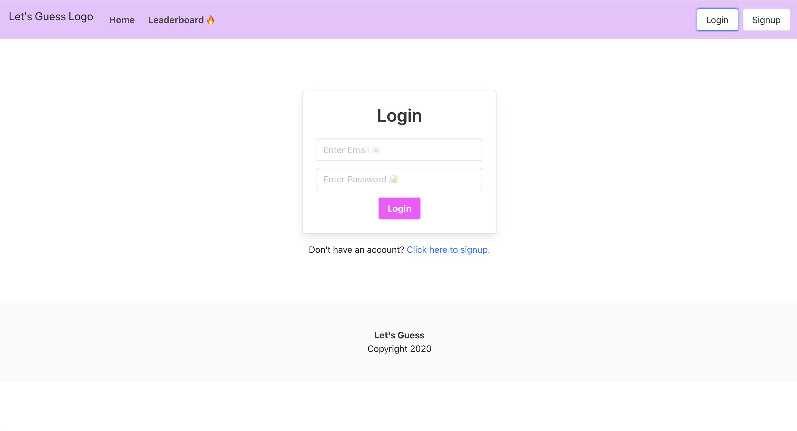

# Lets Guess
    

## Project Description

Let's Guess is a full stack application which allows users to login to play and log their High Scores. 

The application will be deployed on Heroku for the server to run and function properly.   


## Deployment

[Let's Guess](#)





## Table of Contents
  * [Installation](#installation)
  * [Usage](#usage)
  * [Project Technology](#project-technology)
  * [Screenshots of Application](#screenshots-of-application)
  * [Contributing Authors](#contributing-authors)

----
## Installation
To install, run following command in terminal:
  
```
npx create-react-app

yarn start:dev

```

  ## Usage

    ```
    AS AN 
    I WANT 
    SO THAT I 
    ```


----

## Project Technology
<details>
    <summary markdown="span">Click to expand Project Technology Details</summary>

Languages
- HTML
- CSS
- Javascript


Libraries
- [React](jhttps://reactjs.org/)
- [Node.js](nodejs.org)
- [Redux.js](https://redux.js.org/)
- [ReactCardFlip](https://www.npmjs.com/package/react-card-flip)

Yarn Packages
- [Yarn](https://classic.yarnpkg.com/en/)

CSS Framework
- [Bulma](https://bulma.io/)

Cloud Server
- [Heroku](heroku.com/)

</details>


## Screenshots of Application
<details>
    <summary markdown="span">Click to expand Screenshot Details</summary>
 

*Screen Shot of Let's Guess*

</details>


## Contributing Authors
[Andrew Greer](https://github.com/andrewpaulgreer)

[George Flores](https://github.com/lu-gflores)

[Jacob T LaMarre](https://github.com/JTLaMarre)

[Lindsey Lawson](https://github.com/lynseahoss)


