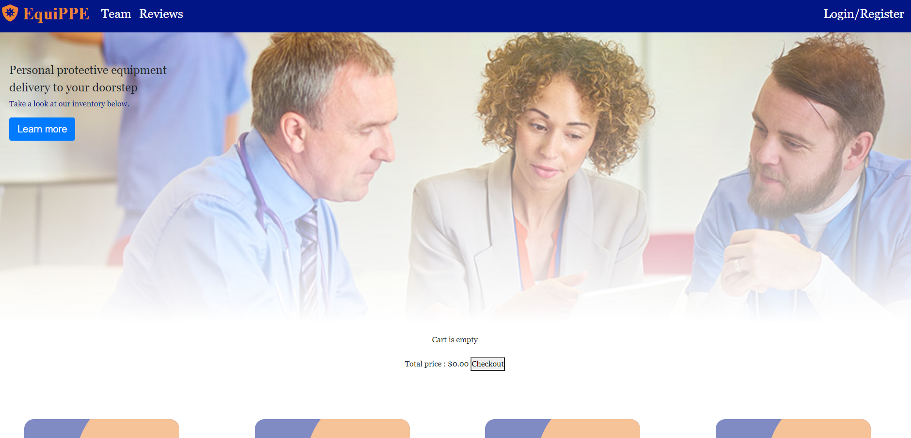

 #  
# E-Commerce Web App Project-3

This application allows users to view an online store of PPE (personal protective equipment) products and add them to the shopping cart. If the user chooses, they can create an account in order to keep track of their order history as well as store their shipping information. If the user so chooses they can also check out as a guest but will not be able to view their previous orders.

 ## Table of Contents
 * [Team](#Team)
 * [Technology](#Technology)
 * [License](#License)
 * [Visuals](#Visuals)
 * [Links](#Links)

## Team
    * Adam Grossman
    * Nick Ryder
    * Ryan Brooks
    * Matt Courtney

## Technology
    * Sequelize
    * Express 
    * MySQL
    * React
    

 ## License
    This project is covered by the MIT license.
 
  ## Visuals
    

  
  ## Links
   * [GitHub](https://github.com/sharkattack182/project-3)
   * [Deployed](#)

