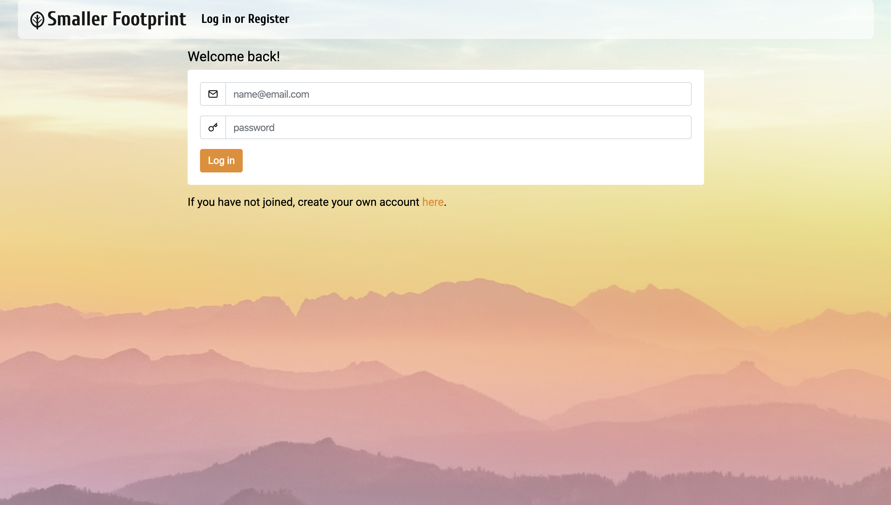

# Smaller Footprint

## User Story

An app that will inspire a user and their friends and family to take on a challenge and incorporate better behaviors to create a smaller footprint on this earth. User will be able to save completed challenges and see their current score. Additionally, users can add or invite friends to join!

* The URL of the GitHub repository

https://github.com/Findjules2/smallerFootprint

* The URL of the deployed application

http://mysmallerfootprint.com/

